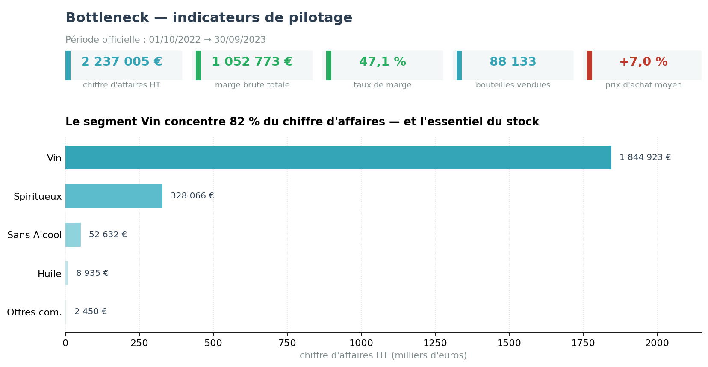

# Bottleneck — Mettre les données à disposition des équipes

> **En une phrase :** après fiabilisation de sa base, un caviste en ligne voulait que ses
> équipes puissent enfin lire leurs propres chiffres ; j'ai comparé les solutions de
> restitution disponibles, retenu Tableau, et livré un tableau de bord en trois pages sur
> **2,24 M€ de chiffre d'affaires** et 88 133 unités vendues.

---

## Contexte et besoin métier

Le responsable des ventes ne demandait pas une analyse — il en avait déjà. Il demandait que
les équipes puissent consulter les chiffres **sans passer par un analyste**. Le sujet n'était
donc pas la donnée mais son **accessibilité**.

Deux livrables : un rapport comparant les solutions d'extraction, de traitement et de
visualisation, puis le tableau de bord lui-même.

---

## Données

Base SQLite exportée en quatre tables, sur la période du 01/10/2022 au 30/09/2023.

| Table | Rôle | Volume |
|---|---|---|
| `Finance` | Prix de vente et d'achat, statut fiscal, disponibilité web par SKU et par mois | 11 323 lignes |
| `Sales` | Ventes par produit et par période | — |
| `Web` | Informations descriptives : titre, segment, type, contenance, statut | — |
| `Promo` | Périodes et taux promotionnels | — |

---

## Démarche

### 1. Comparer les solutions avant d'en choisir une

Le premier livrable est un rapport de comparaison, pas une préconisation d'emblée. Trois
familles d'outils ont été examinées sur des critères explicites — coût, courbe
d'apprentissage, capacité de modélisation, autonomie laissée aux équipes métier,
compatibilité avec l'environnement existant :

- **Préparation** : Power Query, Python, Tableau Prep, Knime
- **Restitution** : Tableau, Power BI, Looker Studio

**Décision : Tableau Desktop**, retenu notamment pour sa compatibilité avec l'environnement
de travail (macOS), où Power BI Desktop n'est pas disponible. Cette contrainte est une
contrainte réelle, et elle a été documentée comme telle plutôt que contournée.

### 2. Modéliser en étoile plutôt que d'aplatir

Les quatre tables sont organisées en modèle relationnel en étoile autour des ventes. Un
fichier unique aplati aurait été plus simple à produire, mais aurait interdit les filtres
croisés dont les équipes ont besoin.

### 3. Structurer par question, pas par table

Trois pages, correspondant à trois questions métier distinctes : *où en est l'activité ?*,
*quels segments et produits performent ?*, *quel est l'effet des prix et des promotions ?*

---

## Résultats

| Indicateur (01/10/2022 – 30/09/2023) | Valeur |
|---|---|
| Chiffre d'affaires HT | **2 237 005 €** |
| Marge totale | **1 052 773 €** |
| Taux de marge | **47,1 %** |
| Quantités vendues | 88 133 |
| CA promotionnel | 175 494 € |
| Évolution du prix d'achat moyen | 16,49 € → 17,65 € (**+7,0 %**) |

**Répartition par segment :**

| Segment | Chiffre d'affaires | Quantités |
|---|---|---|
| Vin | 1 844 923 € | 79 843 |
| Spiritueux | 328 066 € | 4 292 |
| Sans Alcool | 52 632 € | 3 514 |
| Huile | 8 935 € | 386 |
| Offres commerciales | 2 450 € | 98 |

**Trois enseignements livrés :**

1. **Le prix d'achat moyen progresse de 7 % sur l'année.** À prix de vente constant, la marge
   s'érode mécaniquement : c'est un point de surveillance mensuel, pas un constat ponctuel.
2. **Le segment Vin concentre l'essentiel du chiffre d'affaires et du stock.** C'est donc là
   que se joue l'enjeu de trésorerie, quelle que soit la performance des autres segments.
3. **Le segment Sans Alcool pèse peu en CA mais tourne mieux.** Il mérite un suivi séparé :
   un segment à faible chiffre d'affaires et bonne rotation n'appelle pas les mêmes décisions
   qu'un segment lourd et lent.

---

## Limites

- **Une seule année de données** : aucune saisonnalité comparable d'une année sur l'autre.
- **Marge brute uniquement** : les coûts logistiques et de stockage ne sont pas dans les
  données.
- **L'effet des promotions est mesuré en chiffre d'affaires, pas en incrémental** : on ne sait
  pas ce qui se serait vendu sans remise.
- **Actualisation manuelle** : le rafraîchissement suppose une nouvelle extraction de la base.

---

## Prochaines pistes

1. Automatiser l'extraction pour permettre une actualisation hebdomadaire.
2. Ajouter un suivi mensuel du prix d'achat par fournisseur, la hausse de 7 % étant le signal
   le plus actionnable du tableau de bord.
3. Mesurer l'incrémental promotionnel plutôt que le CA promotionnel brut.

---

**Stack :** SQLite · Tableau Prep · Tableau Desktop

**Projets liés :** [rapprochement ERP/web](https://github.com/Eden-Kalil/bottleneck-analyse-stock-ventes) ·
[fiabilisation et POC qualité](https://github.com/Eden-Kalil/bottleneck-fiabilisation-donnees)

---

## Livrables du projet

Les documents produits sont disponibles dans le dossier [`livrables/`](livrables) de ce dépôt :

- [Kalil_Eden_N_2_tableau_de_bord_07_2026_v2.twb](livrables/Kalil_Eden_N_2_tableau_de_bord_07_2026_v2.twb)
- [Kalil_Eden_N1_rapport_documente_072026_V2.pdf](livrables/Kalil_Eden_N1_rapport_documente_072026_V2.pdf)
